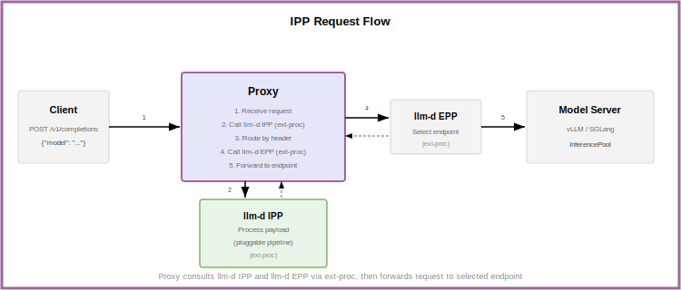

# Inference Payload Processor (IPP)

## Functionality

The **Inference Payload Processor (IPP)** is a pluggable framework for processing inference request and response payloads before and after routing decisions.

IPP enables:

* **Request Processing** — Inspect and modify request headers, body, or trailers before routing decisions are made.
* **Response Processing** — Inspect and modify response headers, body, or trailers after the model server responds.

Common use cases include model-aware routing (extracting model names from request bodies), guardrails, content filtering, payload transformation, and observability hooks.

## Integration

IPP integrates with the Proxy via Envoy's [External Processing (ext-proc)](https://www.envoyproxy.io/docs/envoy/latest/configuration/http/http_filters/ext_proc_filter) protocol.

Both IPP and EPP contribute to routing decisions:

| Component | Routing Scope | Decision |
|-----------|---------------|----------|
| **IPP** | Pool-level | Which InferencePool? |
| **EPP** | Endpoint-level | Which pod within the pool? |

## Request Flow

<p align="center">
  <picture>
    <source media="(prefers-color-scheme: dark)">
    
  </picture>
</p>

1. **Client** sends an inference request to the Proxy.
2. **Proxy** invokes IPP via ext-proc.
3. **IPP** processes the request through its configured plugin pipeline and returns any mutations (headers, body modifications).
4. **Proxy** applies mutations and routes to the appropriate InferencePool.
5. **EPP** selects the optimal pod within the pool.
6. **Model Server** processes the request and returns the response.

## Plugin Architecture

IPP uses a profile-based plugin architecture:

* **Plugins** — Modular units that perform specific processing tasks (e.g., extract fields, set headers, filter models).
* **Profiles** — Named sets of plugins that define processing pipelines for different request types.
* **Profile Picker** — Selects which profile to execute based on request properties.

The processing pipeline executes in this order:

```
PreProcessing → ProfilePicker → Profile Request Plugins → [Model Server] → Profile Response Plugins → PostProcessing
```

For detailed plugin documentation and configuration, see the [IPP repository](https://github.com/llm-d/llm-d-inference-payload-processor).

## Operations

### Deployment

IPP is deployed as a standalone Kubernetes Deployment. The Helm chart automatically configures the appropriate Proxy integration based on your environment:

* **Istio** — Creates an EnvoyFilter to insert ext_proc into the Gateway
* **GKE** — Creates a GCPRoutingExtension resource

### Monitoring

IPP exposes Prometheus-compatible metrics on port 9090 at `/metrics`, providing visibility into request processing and plugin execution latency.

## Further Reading

* [IPP Repository](https://github.com/llm-d/llm-d-inference-payload-processor) — Source code, configuration reference, and plugin documentation
* [Multi-Model Routing](../../../well-lit-paths/foundations/multi-model-routing.md) — Using IPP for model-aware routing
