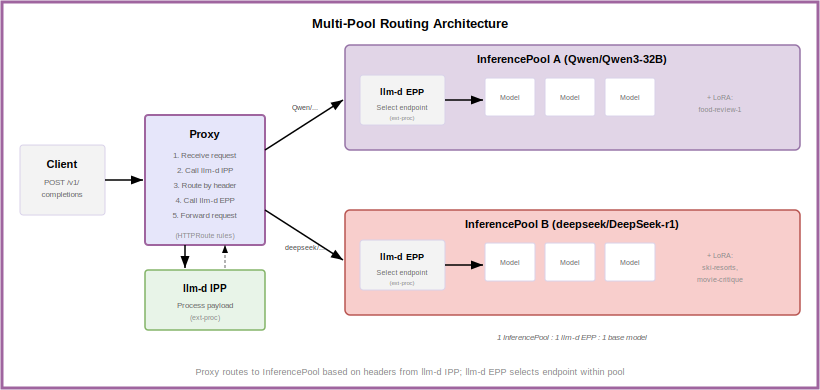

# Multi-Model Routing

Organizations often need to serve multiple large language models behind a single API endpoint. A chatbot application might use a Qwen model for conversational tasks, while a recommendation system uses DeepSeek for complex reasoning. Each base model may also have multiple Low-Rank Adaptation (LoRA) fine-tuned variants serving different use cases.

Traditional path-based routing cannot distinguish between these models when they share the same API path (`/v1/chat/completions`). The **Inference Payload Processor (IPP)** solves this by extracting the model name from the request body and routing to the appropriate InferencePool.

> [!NOTE]
> This capability requires IPP deployment. For simpler deployments serving a single model, see the [Optimized Baseline](optimized-baseline.md) guide instead.

## Deploy

See the [Multi-Model Routing guide](../../../guides/multi-model-routing) for manifests and step-by-step deployment.

## Architecture

  <picture>
    <source media="(prefers-color-scheme: dark)">
    
  </picture>

The setup creates multiple `InferencePools`, each serving a different base model:

* Each **InferencePool** serves one base model and its LoRA adapters.
* **IPP** extracts the model name from the request body and maps it to the base model.
* **HTTPRoutes** match on the `X-Gateway-Base-Model-Name` header to route to the correct pool.
* **EPP** selects the optimal endpoint within each pool.

During the standard request flow:

* Request arrives at the Proxy with `{"model": "food-review-1"}` in the body
* Proxy invokes IPP via ext-proc
* IPP looks up `food-review-1` → base model `Qwen/Qwen3-32B`
* IPP sets header `X-Gateway-Base-Model-Name: Qwen/Qwen3-32B`
* Proxy matches HTTPRoute and routes to `qwen-pool`
* EPP selects endpoint, preserving the original model name
* Model server loads the `food-review-1` LoRA adapter

## Further Reading

See [IPP Architecture](../../architecture/advanced/inference-payload-processing/README.md) for more details on the Inference Payload Processor.
